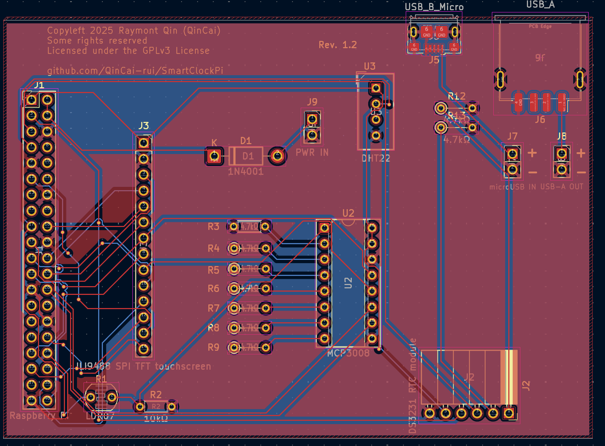

# SmartClockPi

A Raspberry Pi Zero 2 W based smart clock with touchscreen display, environmental sensing, and internet weather integration.

## KiCad Stuff

### PCB Design



### Schematics


## Features

### Display & Interface

- **3.5" ILI9488 SPI TFT Touchscreen** (480x320 pixels)
- Resistive touch input for UI
- Large, clear font display for time and date
- Automatic brightness adjustment via photoresistor (TO-DO, once I get the parts)

### Environmental Monitoring

- **DHT22 Sensor** for indoor temperature, humidity readings
- Real-time sensor data updates

### Weather Integration

- Internet weather data from wttr.in (Auckland, Half Moon Bay area)
- No API key required
- Displays outdoor temperature, humidity, and weather status
- Update every 10 minutes

### Time & Clock Features

- **DS3231 Real-Time Clock (RTC)** with battery backup
- Maintains accurate time even when Pi is powered off (or when my internet dies)
- Large, readable time display

### Hardware Features

- Custom PCB design with modular connections (so i can unplug and replug the modules)
- Female header pins for easy module connection
- Compact form factor (94.5mm x 67.2mm PCB)

## Hardware Components

Please see [SmartClockPi-bom.csv](SmartClockPi-bom.csv) (Created since this is required for Highway)

## Software Features

- **Python-based application** using:
  - `luma.lcd` for display control
  - `adafruit-circuitpython-bme280` for sensor interface
  - `Pillow` for graphics rendering
- Real-time clock display with large, clear fonts. Need to test if this actually works
- Weather data integration from wttr.in
- Environmental sensor monitoring

## Project Structure

```txt
SmartClockPi/
├── README.md
├── JOURNAL.md                # Development journal with progress updates
├── SmartClockPi-bom.csv      # Bill of Materials
├── PCB/                      # KiCad PCB design files
│   ├── smartclockpi.kicad_pro
│   ├── smartclockpi.kicad_sch
│   ├── smartclockpi.kicad_pcb
│   └── Gerber/               # Manufacturing files
└── [Software files to be added]
```

## License

This project is Free and Open-source, licensed under the GPLv3 license. Feel free to contribute or use it for your own projects!

See [LICENSE](LICENSE) for more details.

---
