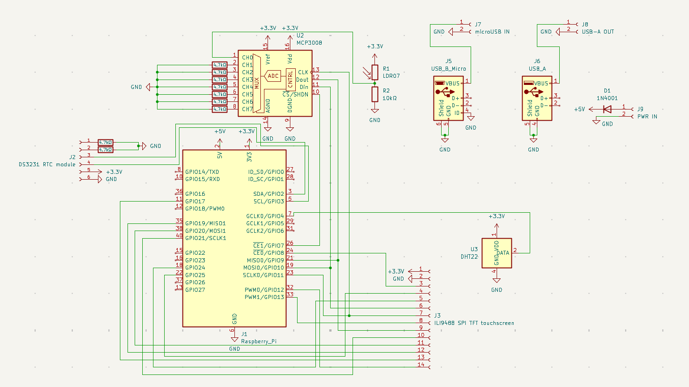

# SmartClockPi

A Raspberry Pi Zero 2 W based smart clock with touchscreen display, environmental sensing, and internet weather integration.

## KiCad Stuff

This project uses KiCad for PCB design. The files are located in the `PCB/` directory. You can open them with KiCad to view the schematics and PCB layout. These are the screenshots of the PCB and schematics:

### PCB Design


### PCB rendering


### Schematics



## Sketch


## BOM (table format)

| Component | Description | Quantity | Link | Price | Shipping | Est. price (exl. GST) | Est. price (inc. GST) |
|-----------|-------------|----------|------|-------|----------|------------------------|------------------------|
| Raspberry Pi Zero 2 W | Main controller/computer of the project | 1 | https://www.aliexpress.com/item/1005007899652009.html | $15.00 | $0.00 | $15.00 | $17.25 |
| ILI9488 3.5" SPI TFT Touchscreen | 480x320 pixel color LCD with resistive touch input, using SPI interface; displays the clock and all UI elements. | 1 | https://www.aliexpress.com/item/1005007096645415.html | $12.34 | $0.00 | $12.34 | $14.19 |
| DHT22 Sensor | provides indoor environmental readings | 1 | https://www.aliexpress.com/item/32759901711.html | $2.05 | $0.00 | $2.05 | $2.36 |
| 1x14 Pin Socket Header | Single-row, female 2.54mm pitch header; connects the TFT display module to the PCB. | 1 (pack of 10, use 1) | https://www.aliexpress.com/item/4001198421663.html | $1.99 | $0.00 | $1.99 | $2.29 |
| 1x6 Pin Socket Header | Single-row, female 2.54mm pitch header; connects the DAC to the PCB. | 1 (pack of 10, use 1) | https://www.aliexpress.com/item/4001198421663.html | $1.70 | $0.00 | $1.70 | $1.96 |
| 1x6 Pin Socket Header Right angled | Single-row, female 2.54mm pitch, right angle header; connects the RTC module to the PCB. | 1 (pack of 5, use 1) | https://www.aliexpress.com/item/1005008210852764.html | $1.64 | $0.00 | $1.64 | $1.89 |
| 1x4 Pin Socket Header | Single-row, female 2.54mm pitch header; connects the DHT22 to the PCB. | 1 (pack of 10, use 1) | https://www.aliexpress.com/item/4001198421663.html | $1.69 | $0.00 | $1.69 | $1.94 |
| Photoresistor | for automatic display brightness adjustment. 5528 | 1 (pack of 50, use 1) | https://www.aliexpress.com/item/1005002145052802.html | $1.66 | $1.68 | $3.34 | $3.84 |
| MCP3008 (DIP) | 8-channel, 10-bit ADC with SPI interface; reads analog sensors like photoresistors. | 3 (use 1) | https://www.digikey.co.nz/en/products/detail/microchip-technology/MCP3008-I-P/319422 | $9.36 | $0.00 | $9.36 | $10.76 |
| DS3231 RTC (module) | Real-time clock module with battery backup; keeps accurate time when Pi is powered off (or when my internet connection dies) | 1 | https://www.aliexpress.com/item/1005008172587774.html | $1.70 | $0.00 | $1.70 | $1.96 |
| DIP-16 IC socket | For MCP3008 (DIP) | 1 (pack of 10, use 1) | https://www.aliexpress.com/item/1005009030108697.html | $0.60 | $1.63 | $2.23 | $2.56 |
| LIR3032 cell | 3.6V Lithium Battery Rechargeable Battery | 1 (pack of 2, use 1) | https://www.aliexpress.com/item/1005009124669879.html | $7.17 | $0.00 | $7.17 | $8.25 |
| micro-USB port | Power input | 5 (use 1) | https://www.digikey.co.nz/en/products/detail/amphenol-cs-fci/10118193-0001LF/2785388 | $2.15 | $0.00 | $2.15 | $2.47 |
| USB-A port | Power output (from battery charger) | 5 (use 1) | https://www.digikey.co.nz/en/products/detail/gct/USB1046-GF-0190-L-B-A/10649632 | $3.65 | $0.00 | $3.65 | $4.20 |
| 18650 Lithium Battery Charger | 5V 2.4A Dual USB OUT | 1 (pack of 2, use 1) | https://www.aliexpress.com/item/1005006839030660.html | $6.77 | $0.00 | $6.77 | $7.79 |
| microSD card | 64GB | 2 (use 1) | https://www.digikey.co.nz/en/products/detail/raspberry-pi/SC1629/24627140 | $12.98 | $0.00 | $12.98 | $14.93 |
| Diode | 1N4001 | 100 | https://www.digikey.co.nz/en/products/detail/diotec-semiconductor/1N4001/13164614 | $4.66 | $0.00 | $4.66 | $5.36 |
| USB speaker |  | 1 | https://www.aliexpress.com/item/1005007586786674.html | $4.52 | $8.20 | $12.72 | $14.63 |
| **TOTAL** |  |  |  |  |  | **$103.14** | **$118.61** |

## Why I Made This

I wanted a smart clock that could display the time, date, indoor temperature, humidity, and outdoor weather conditions. I also wanted it to have a touchscreen interface for easy interaction. The Raspberry Pi Zero 2 W was chosen for its compact size and sufficient processing power for this project.

"Why don't you just buy a pre-made smart clock?" you might ask. Well, I wanted to learn more about PCB layout/designing. This project is a great way to "exercise" while creating something useful for myself.

Also, I wanted to make it modular so I can easily swap out components or add new features in the future. The custom PCB design allows for easy connections and modifications.

## Features

### Display & Interface

- **3.5" ILI9488 SPI TFT Touchscreen** (480x320 pixels)
- Resistive touch input for UI
- Large, clear font display for time and date
- Automatic brightness adjustment via photoresistor (TO-DO, once I get the parts)

### Environmental Monitoring

- **DHT22 Sensor** for indoor temperature, humidity readings
- Real-time sensor data updates

### Weather Integration

- Internet weather data from wttr.in (Auckland, Half Moon Bay area)
- No API key required
- Displays outdoor temperature, humidity, and weather status
- Update every 10 minutes

### Time & Clock Features

- **DS3231 Real-Time Clock (RTC)** with battery backup
- Maintains accurate time even when Pi is powered off (or when my internet dies)
- Large, readable time display

### Hardware Features

- Custom PCB design with modular connections (so i can unplug and replug the modules)
- Female header pins for easy module connection
- Compact form factor (94.5mm x 67.2mm PCB)

## Hardware Components

Please see [SmartClockPi-bom.csv](SmartClockPi-bom.csv) (Created since this is required for Highway)

## Software Features

- **Python-based application** using:
  - `luma.lcd` for display control
  - `adafruit-circuitpython-bme280` for sensor interface
  - `Pillow` for graphics rendering
- Real-time clock display with large, clear fonts. Need to test if this actually works
- Weather data integration from wttr.in
- Environmental sensor monitoring

## Project Structure

```txt
SmartClockPi/
├── README.md
├── JOURNAL.md                # Development journal with progress updates
├── SmartClockPi-bom.csv      # Bill of Materials
├── PCB/                      # KiCad PCB design files
│   ├── smartclockpi.kicad_pro
│   ├── smartclockpi.kicad_sch
│   ├── smartclockpi.kicad_pcb
│   └── Gerber/               # Manufacturing files
└── [Software files to be added]
```

## License

This project is Free and Open-source, licensed under the GPLv3 license. Feel free to contribute or use it for your own projects!

See [LICENSE](LICENSE) for more details.

---
